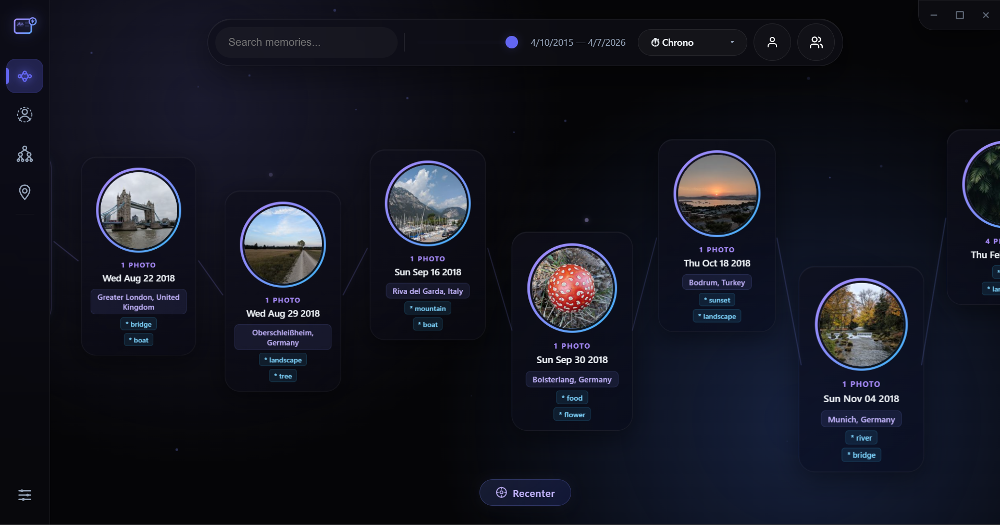
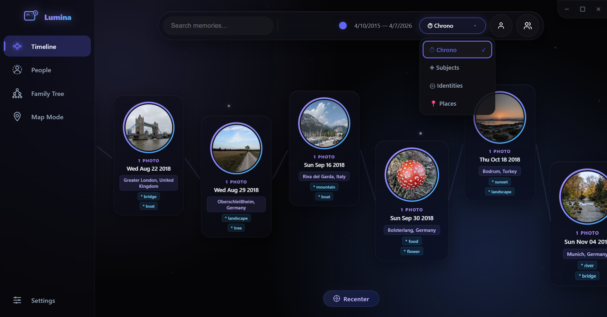
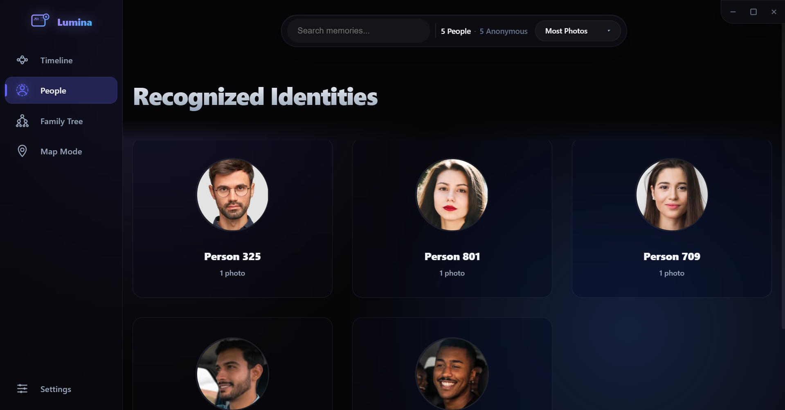
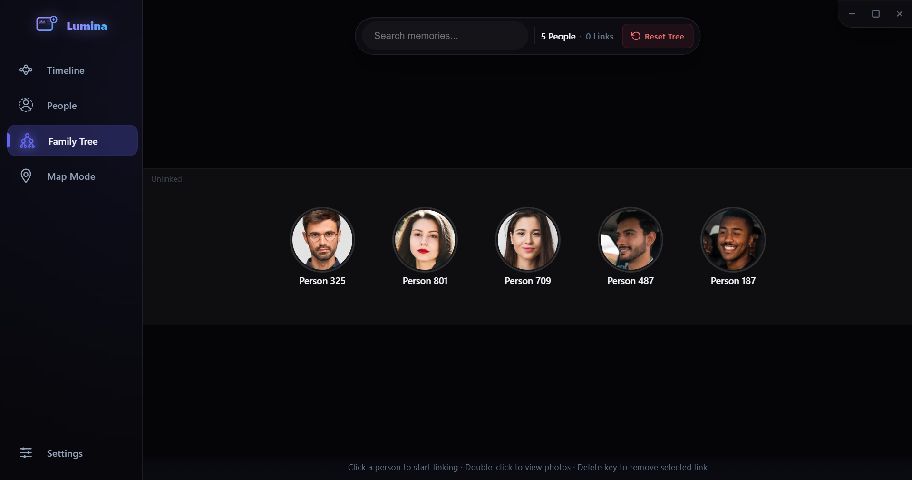
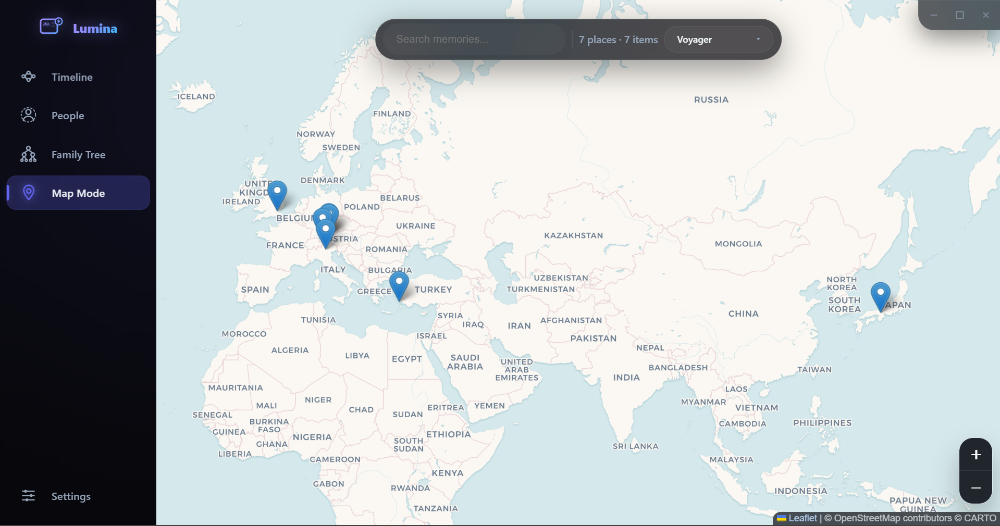

# Lumina

**Lumina** is an AI-powered desktop gallery that helps you rediscover your memories. It goes beyond simple folders, using on-device machine learning to organize your photos and videos by people, locations, visual concepts, and family relationships.

*Your memories, enlightened.*




---

## Key Features

### Semantic Timeline
Explore your memories on a dynamic, zoomable timeline. The app automatically clusters photos into events based on time and location proximity, creating a cohesive story of your life. Switch between multiple grouping modes — **Chrono** (date), **Subjects** (AI-detected objects), **Identities** (people), and **Places** (location) — to see your library from different angles. A progressive reveal system displays images as they are indexed, so the UI is never blocked even with 10,000+ photos.


### Identity Discovery
Advanced face recognition powered by SCRFD detection and MobileFaceNet embeddings identifies individuals across your entire library. Group photos by person, name your friends, and find every moment you shared with them. Sort identities by photo count, name, most recent appearance, or unnamed-first, with a people count summary in the toolbar. Filter the timeline to show only **portraits** (1 person) or **group shots** (2+ people).


### Family Tree
Define relationships between recognized people to build a visual family tree. The tree features:
- **Automatic generation layout** with generation bands (Gen 1, Gen 2, Gen 3, etc.)
- **Smart node positioning** that keeps spouses adjacent and children below their parents
- **Curved connector lines** from parent couples to children, with separate arcing edges for spouse and sibling relationships
- **Interactive relationship labels** displayed on click, showing the relationship type and the names of both connected people
- **Click-to-link workflow** for defining new relationships (parent-child, spouse, sibling)
- **Relationship deletion** via keyboard shortcut (Delete/Backspace) after selecting an edge
- **Double-click navigation** from a tree node into that person's photo cluster, with back-navigation returning to the tree
- **Scrollable layout** with horizontal and vertical overflow when the tree grows large


### Global Map Mode
See where your memories were made. Photos with GPS metadata are pinned to an interactive world map with marker clustering, allowing you to re-travel your favorite journeys. GPS coordinates are automatically reverse-geocoded into human-readable place names via OpenStreetMap Nominatim. Choose between three map tile styles: **Voyager**, **Positron**, and **Dark Matter**.


### Lightbox Viewer
Click any photo to open a full-screen lightbox with keyboard navigation (arrow keys to browse, Escape to close), click-region navigation (left/right thirds of the screen), and a photo counter.

### Intelligent Search
- **Keyword Search**: Find photos by date, location, or automatically identified tags.
- **Semantic Search**: Search for visual concepts (e.g., "sunset at the beach" or "birthday party") powered by CLIP embeddings, even if those words aren't in the filename.
- **Map Search**: In Map Mode, press Enter on a search query to fly to a matching location and open its marker popup.

### Broad Format Support
Lumina handles a wide range of media formats out of the box:
- **Images**: JPG, PNG, WEBP, GIF, BMP, TIFF, SVG
- **Apple HEIC/HEIF**: Automatically converted to JPEG on-the-fly for display and AI analysis, with a persistent cache so conversion only happens once
- **Video**: MP4, MOV, AVI — with an option to include or exclude video files from the Settings panel

### Progressive Indexing
The app is designed for libraries of any size. On first run, a multi-phase indexing pipeline processes your photos in the background:
1. **File discovery** and scanning
2. **Thumbnail generation** and metadata extraction
3. **AI scene tagging** with object detection
4. **Face detection and clustering** for identity discovery
5. **CLIP embedding** for semantic search

A hybrid progressive reveal system keeps the UI responsive during indexing, with a weighted progress bar, phase indicators, toast notifications, and shimmer loading states so you're never staring at a blank screen. A "Skip" button lets you browse available photos while indexing continues in the background.

### Library Management
- **Multi-folder library**: Add or remove any number of source folders from the Settings panel
- **Include/exclude videos**: Toggle video file indexing on or off
- **Refresh Library**: Re-scan folders for new or changed files without rebuilding from scratch
- **File watcher**: The app detects new or changed files and shows a badge on the Settings icon so you know when to refresh
- **Clear Cache & Quit**: Wipe all indexed data (thumbnails, AI tags, face data, search index) and start fresh

### Glassmorphic Interface
A premium, dark-themed UI with:
- Sidebar-driven navigation for a focused workspace
- Floating island toolbar with contextual controls
- Smooth transitions and micro-animations
- Cross-platform consistent design (macOS, Windows, and Linux)

### Graceful Degradation
If AI models fail to download or load (e.g., no internet on first run), the app falls back to basic browsing mode. Thumbnails, metadata, and timeline grouping still work — only AI tagging, face recognition, and semantic search are deferred until the models become available.

---

## Tech Stack

- **Framework**: [Electron](https://www.electronjs.org/) (Desktop)
- **Database**: [SQLite](https://www.sqlite.org/) via `better-sqlite3`
- **Face Detection**: SCRFD (via ONNX Runtime) for fast, accurate face bounding boxes
- **Face Recognition**: MobileFaceNet (via ONNX Runtime) for face embeddings and clustering
- **Scene Understanding**: `Xenova/detr-resnet-50` for object/scene detection
- **Semantic Embeddings**: `Xenova/clip-vit-base-patch32` for visual concept search
- **Metadata**: `exifr` for high-performance EXIF parsing
- **Geocoding**: Reverse geocoding via [OpenStreetMap Nominatim](https://nominatim.openstreetmap.org/) with an LRU cache and SQLite-backed persistence
- **Image Conversion**: `heic-convert` for on-the-fly HEIC/HEIF → JPEG conversion
- **Video**: `fluent-ffmpeg` with bundled `ffmpeg-static` / `ffprobe-static` for thumbnailing and metadata extraction
- **Maps**: [Leaflet](https://leafletjs.com/) with CARTO tile layers
- **Rendering**: Vanilla JavaScript with SVG for the family tree visualization and graph timeline

---

## Getting Started

### Prerequisites
- [Node.js](https://nodejs.org/) (v18 or higher recommended)
- [npm](https://www.npmjs.com/)

### Installation
1. Clone the repository:

```bash
git clone https://github.com/vishalgaikwad3/lumina.git
cd lumina
```

2. Install dependencies:

```bash
npm install
```

3. Rebuild native modules for Electron:

```bash
npm run rebuild
```

4. Start the application:

```bash
npm start
```

### Building for Distribution

```bash
npm run dist
```

This produces platform-specific installers (NSIS/portable/zip on Windows, DMG/zip on macOS, AppImage/deb on Linux).

### Running Tests

```bash
npm test
```

Tests that depend on native SQLite are automatically skipped when running under system Node.js (they require Electron's runtime).

---

## Privacy First
Lumina is **offline-first**. All AI processing, face recognition, and indexing happen locally on your machine. Your photos and personal data never leave your device. The only network request is optional reverse geocoding of GPS coordinates via OpenStreetMap Nominatim to resolve place names.

## License
This project is licensed under the ISC License.